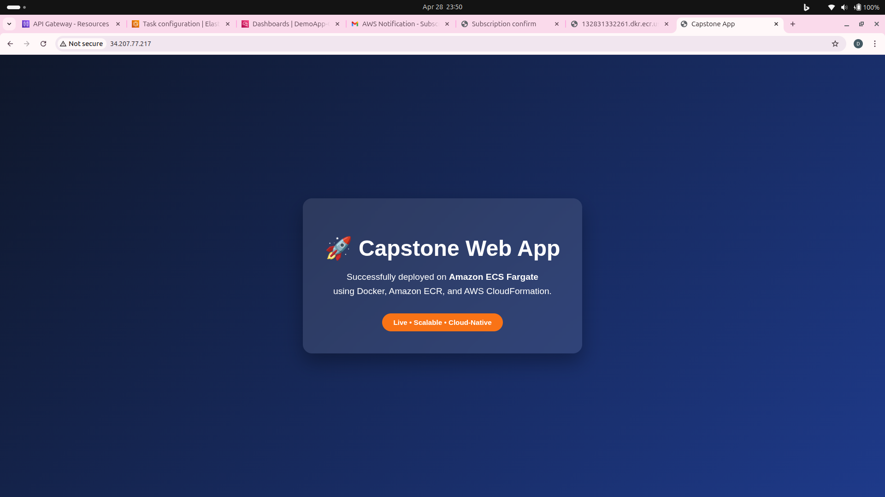
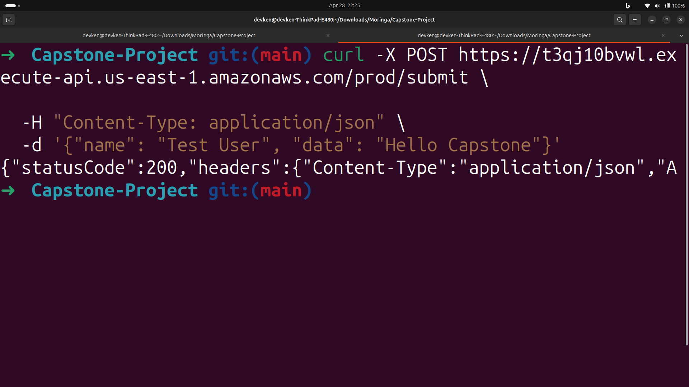
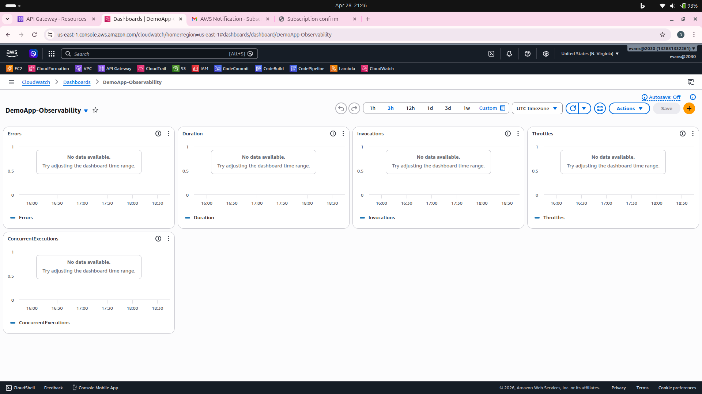
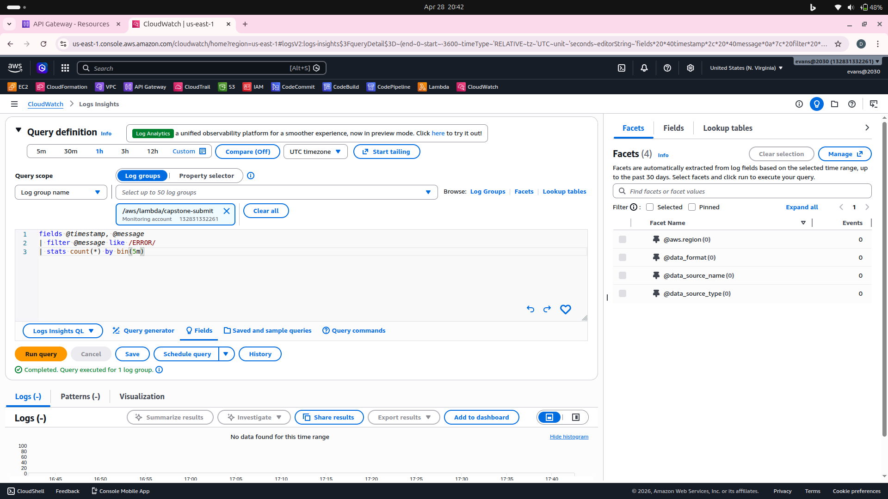
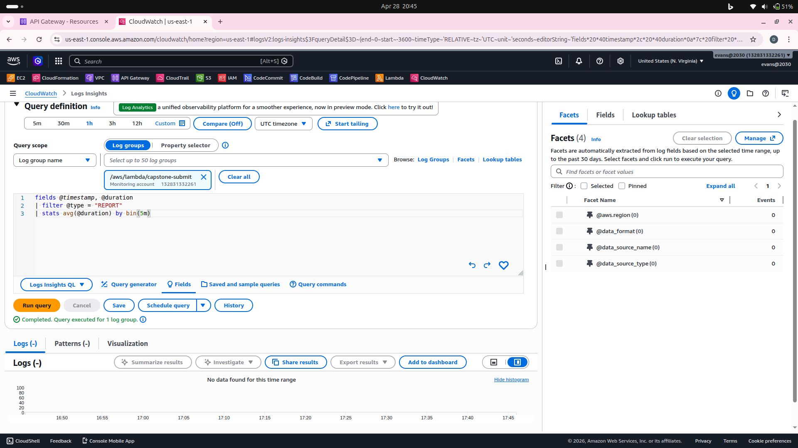
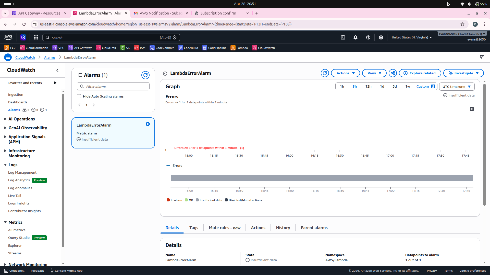
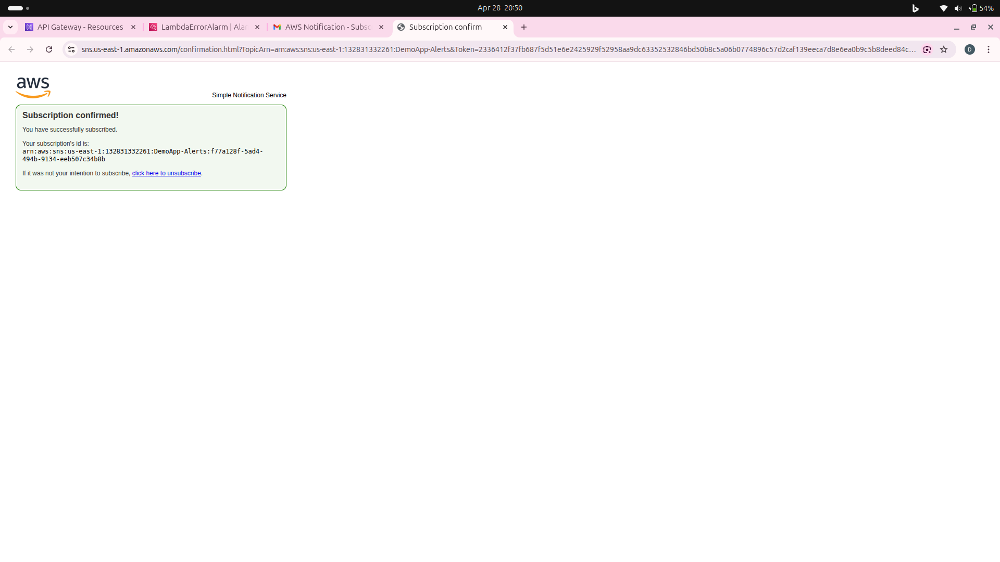
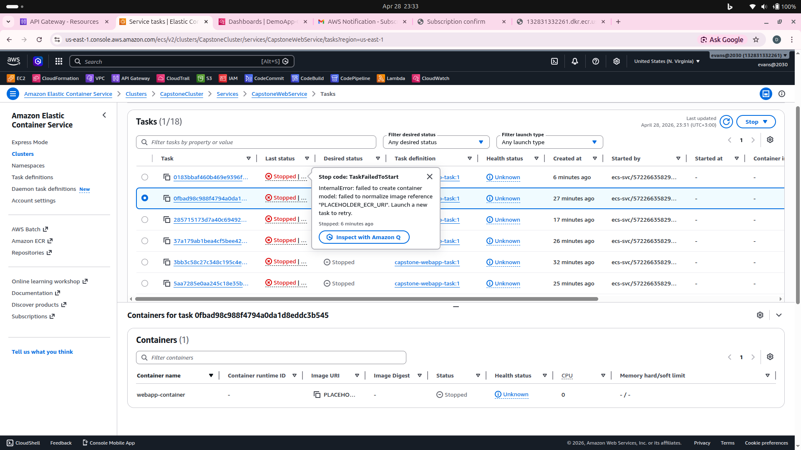

# Capstone Project: Serverless API & Containerized Web App
**Week 1 Foundations: Bringing It All Together**

## 🏗️ Project Overview
This project demonstrates a hybrid cloud-native architecture on AWS, combining a containerized frontend with a serverless backend. The deployment is automated using Infrastructure as Code (IaC) to ensure consistency and scalability across the environment.

### Architecture
* **Infrastructure as Code:** AWS CloudFormation for automated resource provisioning.
* **Containerized App:** Amazon ECS (Fargate) hosting a lightweight Nginx web application.
* **Serverless API:** Amazon API Gateway and AWS Lambda handling backend requests.
* **Observability:** Amazon CloudWatch for logging, metrics, and health dashboards.

---

## 🛠️ Repository Structure
* `infrastructure.yml`: CloudFormation template for ECS Cluster, Task Definition, and Fargate Service.
* `lambda-api/`: Folder containing the Node.js Lambda function code (`index.js`).
* `webapp/`: Folder containing the Dockerfile and static web app source code.
* `media/`: Evidence of deployment success and system monitoring.

---

## 🚀 Deployment Steps

### 1. The Containerized Web App
* Developed a static website and packaged it using a lightweight `nginx:alpine` Docker image.
* Pushed the image to **Amazon ECR** (Elastic Container Registry).
* Deployed the ECS Cluster and Fargate Service using the `infrastructure.yml` CloudFormation template.

### 2. The Serverless API
* Created an **AWS Lambda** function to accept JSON payloads and return a success message with a unique submission ID.
* Configured **Amazon API Gateway** with a `POST /submit` route integrated with the Lambda function.

### 3. Observability
* Configured a **CloudWatch Dashboard** to monitor Lambda Invocations, Errors, and Duration.
* Verified logging functionality through **CloudWatch Logs Insights**.

---

## 📊 Evidence of Success

### 1. Live ECS Web Application
The web application is live and accessible via a public IP address, showing successful deployment on Fargate.

### 2. API Gateway Test
A successful POST request to the API endpoint showing a `200 OK` status and the returned submission message.

### 3. Custom CloudWatch Dashboard
Custom dashboard visualizing key metrics including Lambda Invocations and system health.

---

## 🛡️ Advanced Monitoring & Deployment Insights

Beyond the core requirements, this project implements advanced observability and performance tracking to ensure production-level reliability.

### Performance Analysis & Reliability
* **Lambda Execution Analysis:** Used CloudWatch Logs Insights to analyze the average execution duration of the backend API, ensuring low latency for users.
* **Automated Alerting:** Configured a `LambdaErrorAlarm` to notify administrators immediately if the API failure rate exceeds defined thresholds.
* **SNS Integration:** Successfully confirmed subscription to the Amazon SNS topic for real-time alert delivery.

### Key Technical Factors
* **Zero-Downtime Deployment:** The ECS service was configured to ensure the web app remains available during updates.
* **Granular Logging:** Every API request is captured in detailed logs, allowing for deep-dive debugging through specific log groups.
* **Infrastructure Validation:** Verified the complete stack lifecycle, including successful stack creation and change-set execution via the AWS CLI.

### Additional Evidence

### 4. Deep-Dive Logs Insights
Evidence of detailed log analysis using CloudWatch Logs Insights to verify data capture and system behavior.

### 5. Performance Benchmarking
Analysis of the **Average Execution Duration** for the Lambda backend to ensure optimal latency and user experience.

### 6. Proactive Health Alarms
Configuration of a `LambdaErrorAlarm` to monitor for system failures and ensure high availability.

### 7. Notification System Verification
Confirmation of the Amazon SNS subscription to ensure that automated health alerts are successfully delivered.

### 8. MAjor Errors
Some of the major issues I faced during deployment

---

## 🧹 Cleanup
To avoid unnecessary AWS costs:
1. Delete the CloudFormation Stack.
2. Delete the ECR Repository and images.
3. Remove the API Gateway and Lambda function.